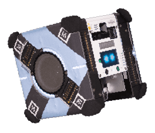
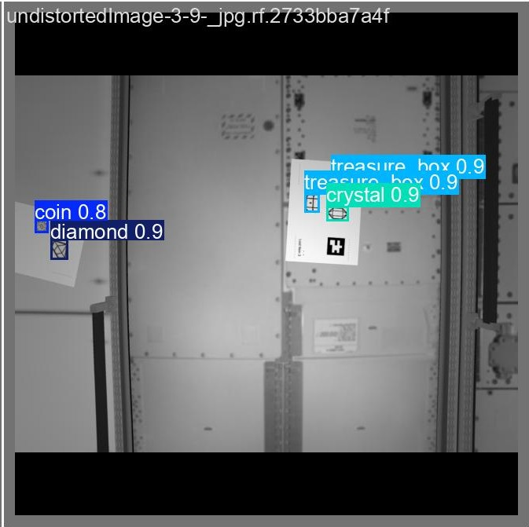
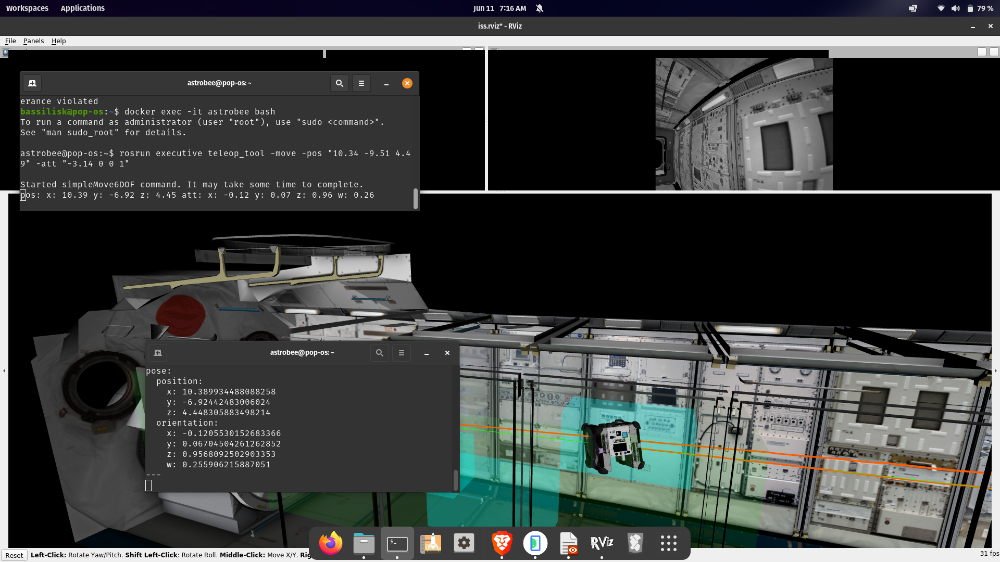

# Kibo RPC Code — 6th Challenge

Code from our team's participation in the **6th Kibo Robot Programming Challenge (Kibo-RPC)**, organized by JAXA and NASA. We finished **9th nationally**.

> **What is Kibo-RPC?**  
> The [Kibo Robot Programming Challenge](https://jaxa.krpc.jp/) is an annual competition in which student teams program Astrobee, a free-flying robot aboard the International Space Station (ISS), to autonomously complete a series of tasks. Teams write code that runs on the actual ISS hardware after passing through simulation rounds.

<p align="center">
  
</p>

---

## Repository Structure

```
kibo-rpc-code/
├── code-using-opencv/   # Java — robot control using OpenCV for image detection
├── code-using-yolo/     # Java — robot control using a custom-trained YOLO model
└── yolo code/           # Python — model training scripts used to produce the YOLO weights
```

**How the two YOLO folders relate:**  
The Python code in `yolo code/` was used to train a custom YOLO object detection model. The resulting weights were then bundled into the Java project in `code-using-yolo/`, which runs on the Astrobee robot during the competition.

---

## Approaches

### OpenCV (`code-using-opencv/`)
Classical computer vision approach written in Java. Handles target detection using OpenCV image processing techniques within the Kibo-RPC SDK.

### YOLO (`code-using-yolo/` + `yolo code/`)
A two-part implementation: a Python training pipeline to produce a custom-trained YOLO model, and a Java implementation that runs inference on the robot via the Kibo-RPC SDK. The YOLO approach yielded more robust detection under varying ISS lighting conditions.

**Detection output (YOLO validation batch):**

<p align="center">
  
</p>

**Simulator (RViz) running the robot navigation code:**

<p align="center">
  
</p>

---

## Results

Finished **9th place** nationally in the 6th Kibo-RPC.
